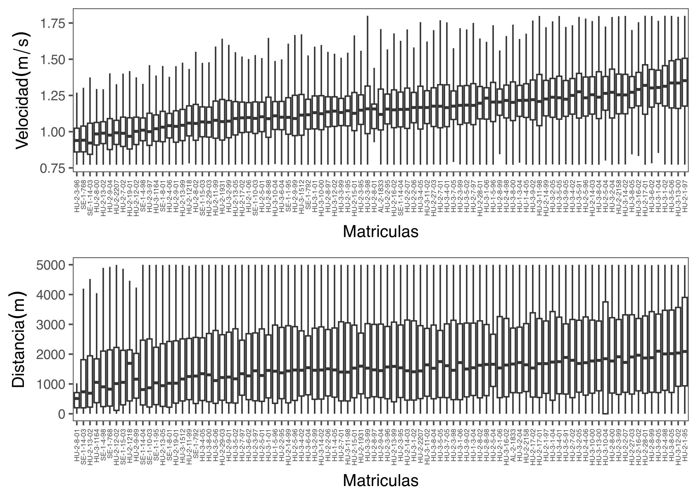

\newpage


```r
library(tidyverse)
library(ggridges)
library(readxl)
library(here)
library(lubridate)
library(readr)
library(ggthemes)
library(hrbrthemes)
library(kableExtra)
library(gtsummary)
library(egg)
library(ggthemes)
library(sf)
```


# CONTEXTO

# DATA

Existen tres tipos de archivos que contienen los datos de fauna y registros.  Entre ellos, lo comun es la Columna `Estación` . Los archivos son `Datos_estaciones_ACUVEN_3D_IN-BENTO.xlsx`,  `Fauna_danos_all.xlsx` y `Station.xlsx`

El archivo `Station.xlsx` tieme el area asociada
[@Indicator]


```r
fauna <- read_excel(here("DATOS",
                         "Fauna_danos_all.xlsx"))
station <- read_excel(here("DATOS",
                         "Station.xlsx"))
rendi <- read_excel(here("DATOS",
                         "Datos_estaciones_ACUVEN_3D_IN-BENTO.xlsx"),
                         skip = 3)
```
## Datos Fauna


```r
unique(fauna$ID_FINAL)
names(fauna)
```

Agrupar por diversas variables 


```r
cantes <- fauna %>% 
  group_by(ID_FINAL) %>%
  summarize(SUM = sum(`Total Indiv...49`,
                                     na.rm = TRUE),
            SUMPES = sum(`Peso total (g)...50`))

indsum <- ggplot(cantes %>% 
                   drop_na(ID_FINAL))+
  geom_col(aes(x =ID_FINAL, y= SUM, fill=ID_FINAL))+
  theme_few()+
  theme(axis.text.x = element_text(angle = 90,
                                     hjust = 1,
                                     vjust = 0.5,
                                     size = 5),
        legend.position = "none")
  

pessum <- ggplot(cantes %>% 
                   drop_na(ID_FINAL))+
  geom_col(aes(x =ID_FINAL, y= SUMPES, fill=ID_FINAL))+
  theme_few()+
  theme(axis.text.x = element_text(angle = 90,
                                     hjust = 1,
                                     vjust = 0.5,
                                     size = 5),
        legend.position = "none")
```


```r
indsum
```


```r
pessum
```


## Datos Lances


```r
setrendi <- rendi %>% 
  group_by()

den <- ggplot(rendi)+
  geom_point(aes(Estaciones, dens))+
  theme_few()

bio <- ggplot(rendi)+
  geom_col(aes(Estaciones, bio))+
  theme_few()

ren <- ggplot(rendi)+
  geom_col(aes(Estaciones, rend))+
  theme_few()

area <- ggplot(rendi)+
  geom_point(aes(area, rend))+
  geom_smooth(aes(area, rend))+
  theme_few()

ggarrange(den, bio , ren, area, ncol=2)
```


Entender las profundidades 


```r
f <- ggplot(rendi)+
  geom_histogram(aes(depth_f),
                 binwidth = 1,
                 fill = "transparent", color = "red")+
  theme_few()
i <- ggplot(rendi)+
  geom_histogram(aes(depth_i),
                 binwidth = 1,
                 fill = "transparent", color = "blue")+
  theme_few()
m <- ggplot(rendi)+
  geom_histogram(aes(depth_m),
                 binwidth = 1,
                 fill = "transparent", color = "green")+
  theme_few()

ggarrange(f, i , m , ncol=3)
```


## Analisis jerarquicos

(progreso)

## Unir bases


```r
names(fauna)
```

```
##  [1] "CAMPAÑA"              "ESTACIÓN"             "CATEGORÍA"           
##  [4] "FECHA"                "PHYLA/Subphylum"      "GRUPO"               
##  [7] "ID_CAMPO"             "ID_FINAL"             "ESTACIÓN + CATEGORÍA"
## [10] "N_ DO...10"           "P_D0...11"            "N_D1...12"           
## [13] "P_D1...13"            "N_D2...14"            "P_D2...15"           
## [16] "N_D3...16"            "P_D3...17"            "Total Indiv...18"    
## [19] "Peso total (g)...19"  "N_ DO...20"           "P_D0...21"           
## [22] "N_D1...22"            "P_D1...23"            "N_D2...24"           
## [25] "P_D2...25"            "N_D3...26"            "P_D3...27"           
## [28] "Total Indiv...28"     "Peso total (g)...29"  "FP"                  
## [31] "N_ DO...31"           "P_D0...32"            "N_D1...33"           
## [34] "P_D1...34"            "N_D2...35"            "P_D2...36"           
## [37] "N_D3...37"            "P_D3...38"            "Total Indiv...39"    
## [40] "Peso total (g)...40"  "N_ DO...41"           "P_D0...42"           
## [43] "N_D1...43"            "P_D1...44"            "N_D2...45"           
## [46] "P_D2...46"            "N_D3...47"            "P_D3...48"           
## [49] "Total Indiv...49"     "Peso total (g)...50"  "%D0"                 
## [52] "%D1"                  "%D2"                  "%D3"                 
## [55] "%DT"
```

```r
names(station)
```

```
## [1] "Estaciones"    "Observaciones" "area"          "station"
```

```r
names(rendi)
```

```
##  [1] "Estaciones"              "Observaciones"          
##  [3] "Date"                    "Track"                  
##  [5] "Track (m)"               "depth_i"                
##  [7] "depth_f"                 "depth_m"                
##  [9] "vel_i"                   "vel_f"                  
## [11] "vel_m"                   "hora_i"                 
## [13] "hora_f"                  "g...14"                 
## [15] "min...15"                "g...16"                 
## [17] "min...17"                "LAT"                    
## [19] "LONG"                    "Nºrejillas"             
## [21] "Vol (l.)...21"           "Vol (l.)...22"          
## [23] "P (total + cascajo) (g)" "SW_tolva"               
## [25] "CSW"                     "CSW_tolva"              
## [27] "N"                       "N_tolva"                
## [29] "area"                    "dens"                   
## [31] "bio"                     "P cascajo (g)"          
## [33] "P cascajo_tolva"         "Tow_time"               
## [35] "PComercial (kg)"         "rend"                   
## [37] "ID"                      "FP"
```
Cambio el nombre estación en `fauna`


```r
fauna1 <- fauna %>% 
  rename("Estaciones"="ESTACIÓN") %>% 
  mutate(Estaciones = as.double(str_replace(Estaciones, "^E0*", ""))) %>% 
  drop_na(Estaciones)
```


```r
base1  <- left_join(rendi, fauna1,
                   by="Estaciones")
```
# MAPAS

Ahora produzco un mapa de las grillas utilizadas en la pesquería de Chirla. Estos datos vectoriales fueron obtenidos desde la paina oficial de datos espaciales de la Junta de Andalucia [Shapesfile](https://portalrediam.cica.es/descargas?path=%2F08_AMBITOS_INTERES_AMBIENTAL%2F02_LITORAL_MARINO%2F04_SOCIOECONOMIA%2FZonasProduccionMoluscos)

## Leo Shapes y transformo a la proyección correcta.

```
## Reading layer `costa_proyectada' from data source 
##   `/Users/mauriciomardones/IEO/IN_BENTOS/SHP_Chirla/costa_proyectada.shp' 
##   using driver `ESRI Shapefile'
## Simple feature collection with 10 features and 4 fields
## Geometry type: POLYGON
## Dimension:     XY
## Bounding box:  xmin: -34115.27 ymin: 3891271 xmax: 301588.8 ymax: 4173659
## Projected CRS: WGS_1984_Complex_UTM_Zone_30N
```

```
## Reading layer `cuadriculas_definitivo' from data source 
##   `/Users/mauriciomardones/IEO/IN_BENTOS/SHP_Chirla/cuadriculas_definitivo.shp' 
##   using driver `ESRI Shapefile'
## Simple feature collection with 219 features and 2 fields
## Geometry type: POLYGON
## Dimension:     XY
## Bounding box:  xmin: 109273.6 ymin: 4071852 xmax: 198073.5 ymax: 4125446
## Projected CRS: ETRS89 / UTM zone 30N
```

```
## Reading layer `batimetria_rediam20x20_10m_id' from data source 
##   `/Users/mauriciomardones/IEO/IN_BENTOS/SHP_Chirla/batimetria_rediam20x20_10m_id.shp' 
##   using driver `ESRI Shapefile'
## Simple feature collection with 1 feature and 1 field
## Geometry type: MULTIPOLYGON
## Dimension:     XY
## Bounding box:  xmin: 99337.29 ymin: 4070000 xmax: 201873.6 ymax: 4127412
## Projected CRS: ETRS89 / UTM zone 30N
```
## Transforma data

```r
grilla1 <- st_transform(grilla, "+init=epsg:4326")
costandalucia1 <- st_transform(costandalucia, "+init=epsg:4326")
bati1 <- st_transform(bati, "+init=epsg:4326")
```

ploteo test
 

```r
mas <- ggplot() +
  #geom_sf(data = lito1, fill="white", color="blue") +
  geom_sf(data = grilla1, fill="white", color="red") +
  geom_sf(data = costandalucia1, fill="#fee8c8") +
  #geom_sf(data = bati1, fill="white", color="blue") +
  # geom_sf(data = fisicomar1, alpha=0.1,
  #         linetype=5) +
  scale_fill_viridis_d(option="H",
                       alpha=.5)+
  coord_sf() +
  xlab(expression(paste(Longitude^o,~'O'))) +
  ylab(expression(paste(Latitude^o,~'S')))+
  # ggrepel::geom_label_repel(
  #   data = zonapro1,
  #   aes(label = ZONA, geometry = geometry),
  #   stat = "sf_coordinates",
  #   min.segment.length = ,
  #   colour = "black",
  #   size = 2,
  #   segment.colour = "black",
  #   box.padding = 0.7,
  #   max.overlaps = 50) +
  theme_few()+
  theme(legend.position = "none")+
  xlim(-7.6,-6)+
  ylim(36.6, 37.4)
mas
```


Ahora identifico la base que quiero plotear


```r
names(rendi)
```

```
##  [1] "Estaciones"              "Observaciones"          
##  [3] "Date"                    "Track"                  
##  [5] "Track (m)"               "depth_i"                
##  [7] "depth_f"                 "depth_m"                
##  [9] "vel_i"                   "vel_f"                  
## [11] "vel_m"                   "hora_i"                 
## [13] "hora_f"                  "g...14"                 
## [15] "min...15"                "g...16"                 
## [17] "min...17"                "LAT"                    
## [19] "LONG"                    "Nºrejillas"             
## [21] "Vol (l.)...21"           "Vol (l.)...22"          
## [23] "P (total + cascajo) (g)" "SW_tolva"               
## [25] "CSW"                     "CSW_tolva"              
## [27] "N"                       "N_tolva"                
## [29] "area"                    "dens"                   
## [31] "bio"                     "P cascajo (g)"          
## [33] "P cascajo_tolva"         "Tow_time"               
## [35] "PComercial (kg)"         "rend"                   
## [37] "ID"                      "FP"
```

```r
rendi2 <- rendi %>% 
  mutate(LONG1 = LONG*-1) %>% 
  st_as_sf(coords = c("LONG1", "LAT"),  
                  crs = "+init=epsg:4326") 
```

This grid has the same characteristics as the environmental data grids
that will be called up later. This grid is 1x0.5 degrees which allows a
clear visualization of the processes, whether biological and/or
environmental.


```r
#Aca dejo este code para hacer una grilla
# Grid<- suba1aa  %>% #pm481 es el plot base original linea 481
#   sf::st_make_grid(cellsize = c(1,0.5)) %>% # para que quede cuadrada
#   sf::st_cast("MULTIPOLYGON") %>%
#   sf::st_sf()  %>%  # objeto en spatial feature
#   dplyr::mutate(cellid = row_number()) 
# 
# # Clean the input data by removing duplicate vertices and making the object topologically valid
# grid3 <- st_make_valid(Grid)
# 
# # Corto la grilla dentro de las SSMU
# #gridcrop1 <- crop_shape(grid3, suba1aa, polygon = TRUE)

# the first object drives the output geometry
grilla2 <- grilla1 %>%
  rename("Estaciones" = "ID_CELDA") 
# ahora uno
grilla3 <- st_join(grilla2, rendi2)
names(grilla3)
```

```
##  [1] "Estaciones.x"            "area.x"                 
##  [3] "Estaciones.y"            "Observaciones"          
##  [5] "Date"                    "Track"                  
##  [7] "Track (m)"               "depth_i"                
##  [9] "depth_f"                 "depth_m"                
## [11] "vel_i"                   "vel_f"                  
## [13] "vel_m"                   "hora_i"                 
## [15] "hora_f"                  "g...14"                 
## [17] "min...15"                "g...16"                 
## [19] "min...17"                "LONG"                   
## [21] "Nºrejillas"              "Vol (l.)...21"          
## [23] "Vol (l.)...22"           "P (total + cascajo) (g)"
## [25] "SW_tolva"                "CSW"                    
## [27] "CSW_tolva"               "N"                      
## [29] "N_tolva"                 "area.y"                 
## [31] "dens"                    "bio"                    
## [33] "P cascajo (g)"           "P cascajo_tolva"        
## [35] "Tow_time"                "PComercial (kg)"        
## [37] "rend"                    "ID"                     
## [39] "FP"                      "geometry"
```
repito el mapa con rendimientos


```r
masrend <- ggplot() +
  #geom_sf(data = lito1, fill="white", color="blue") +
  geom_sf(data = grilla1, fill="white", color="red") +
  geom_sf(data = costandalucia1, fill="#fee8c8") +
  geom_sf(data = grilla3 %>% 
            filter(rend>0.01), aes(fill=rend))+
  # geom_sf(data = fisicomar1, alpha=0.1,
  #         linetype=5) +
  scale_fill_viridis_b(option="F",
                       name="Rendimiento (Captura/Hr)")+
    coord_sf() +
  xlab(expression(paste(Longitude^o,~'O'))) +
  ylab(expression(paste(Latitude^o,~'S')))+
  # ggrepel::geom_label_repel(
  #   data = zonapro1,
  #   aes(label = ZONA, geometry = geometry),
  #   stat = "sf_coordinates",
  #   min.segment.length = ,
  #   colour = "black",
  #   size = 2,
  #   segment.colour = "black",
  #   box.padding = 0.7,
  #   max.overlaps = 50) +
  theme_few()+
  theme(legend.position = "bottom")+
  xlim(-7.6,-6)+
  ylim(36.6, 37.4)

masrend
```


repito el mapa con rendimientos


```r
mascapt <- ggplot() +
  #geom_sf(data = lito1, fill="white", color="blue") +
  geom_sf(data = grilla1, fill="white", color="red") +
  geom_sf(data = costandalucia1, fill="#fee8c8") +
  geom_sf(data = grilla3 %>% 
            filter(`PComercial (kg)`>0.01), 
          aes(fill=`PComercial (kg)`))+
  # geom_sf(data = fisicomar1, alpha=0.1,
  #         linetype=5) +
  scale_fill_viridis_b(option="G",
                       name="Captura (kg)",
                        breaks = seq(0,50,10))+
    coord_sf() +
  xlab(expression(paste(Longitude^o,~'O'))) +
  ylab(expression(paste(Latitude^o,~'S')))+
  # ggrepel::geom_label_repel(
  #   data = zonapro1,
  #   aes(label = ZONA, geometry = geometry),
  #   stat = "sf_coordinates",
  #   min.segment.length = ,
  #   colour = "black",
  #   size = 2,
  #   segment.colour = "black",
  #   box.padding = 0.7,
  #   max.overlaps = 50) +
  theme_few()+
  theme(legend.position = "bottom")+
  xlim(-7.6,-6)+
  ylim(36.6, 37.4)

mascapt
```


\newpage

# REFERENCIAS
