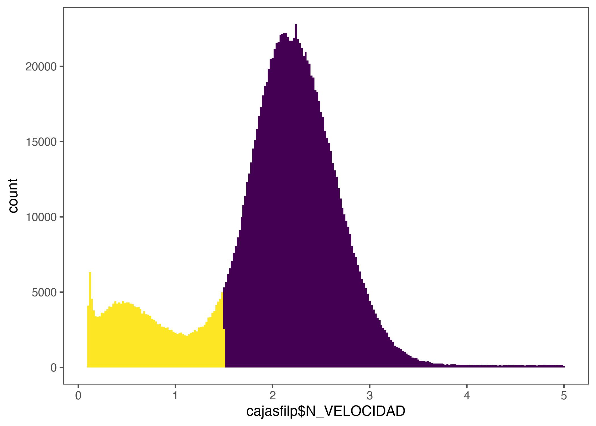
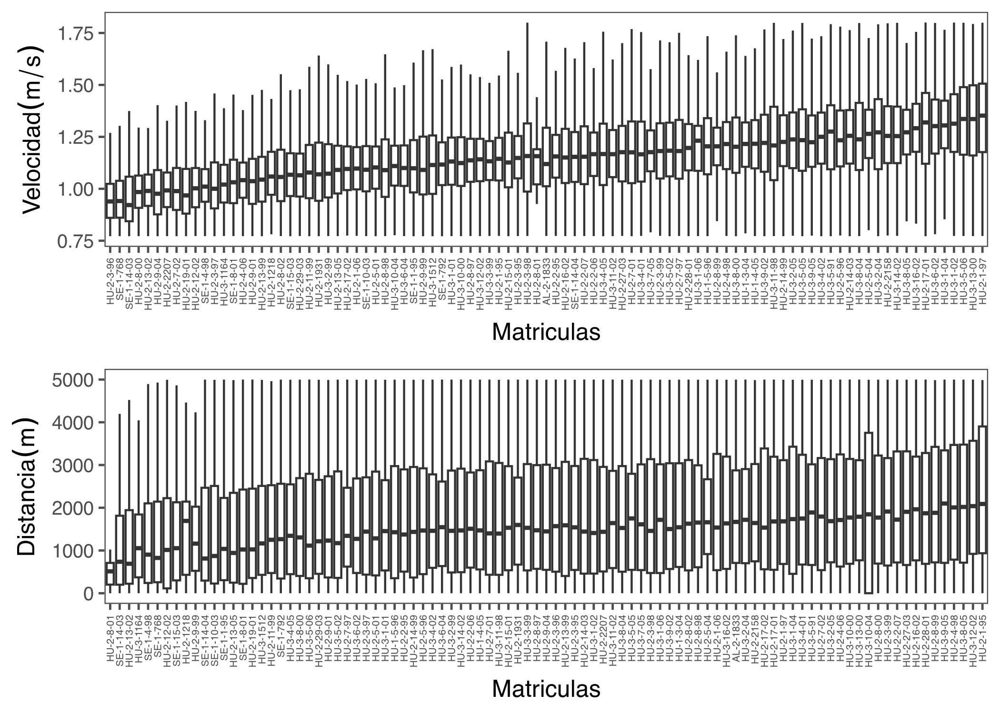
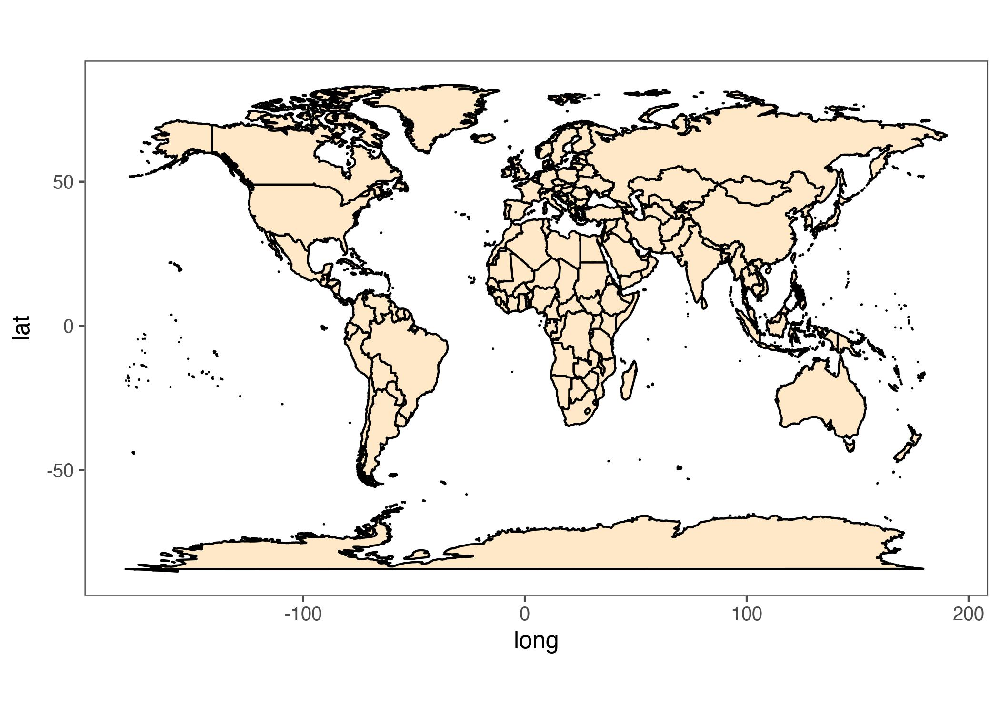
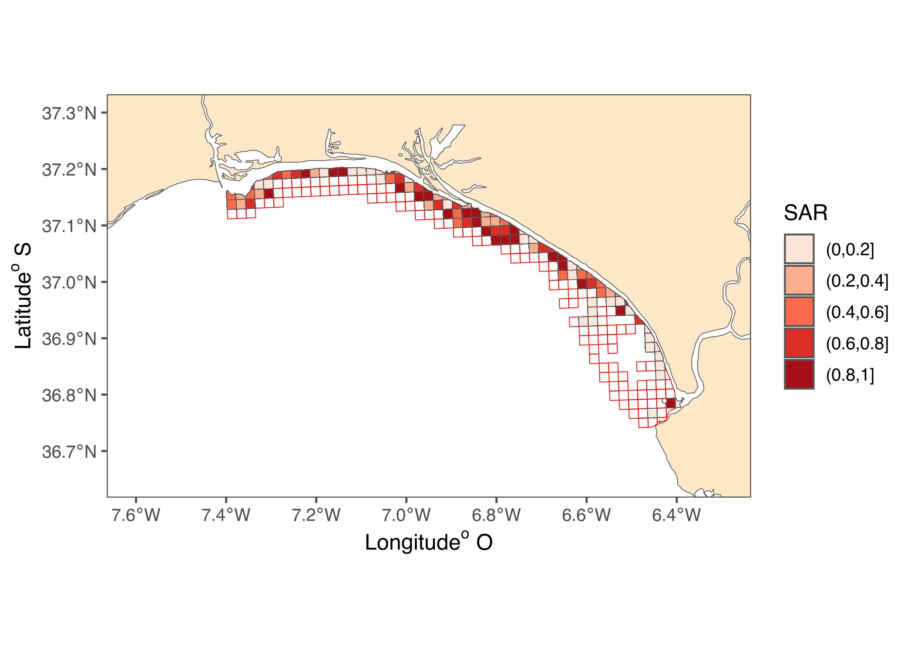
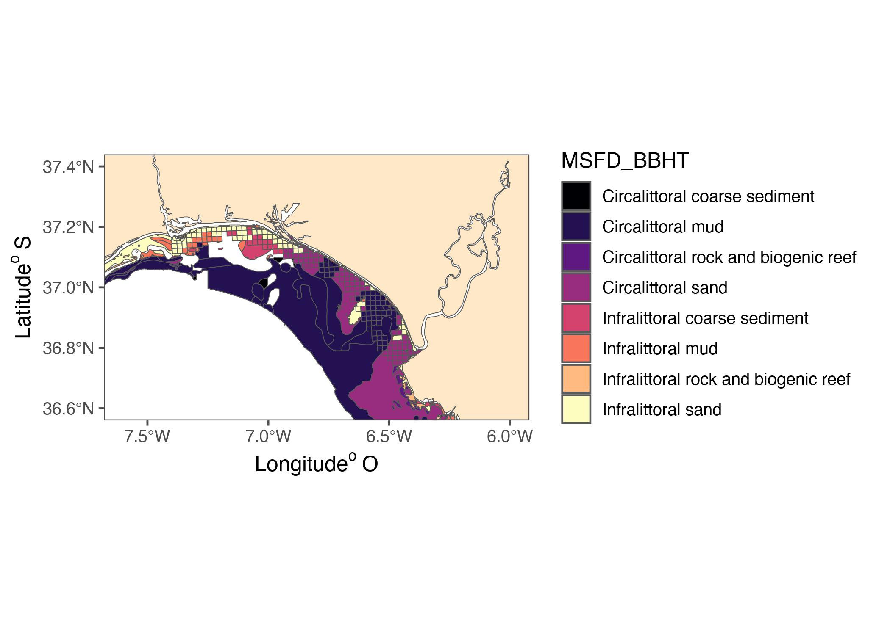

```r
library(tidyverse)
library(ggridges)
library(readxl)
library(here)
library(lubridate)
library(readr)
library(ggthemes)
library(hrbrthemes)
library(kableExtra)
library(gtsummary)
library(egg)
library(ggthemes)
library(geosphere)
library(sp)
library(sf)
```

# ABSTRACT

This abstract presents a method to calculate the SAR (Swept Area Ratio) using satellite data from a fleet of nearly 100 vessels in the artisanal fishing of Chirla in the Gulf of Cadiz. Artisanal fisheries, like Chirla fishing, often lack comprehensive data, hampering effective management. Leveraging satellite imagery, particularly through green boxes technology, offers a unique advantage by providing real-time spatial information on fishing activity. With this method, we can continuously identify the fleet's effort in both spatial and temporal terms. The objective is to develop an ad hoc approach reproducible through accessible codes and open data, facilitating sustainable fisheries management in the Gulf of Cadiz and beyond.

# INTRODUCTION


Making better use of tracking data can reveal the spatiotemporal and intraspecific variability of species distributions 

# METHODOLOGY

## DATA SATELITAL VESSEL

Por ahora solo trabajaremos con la data entregada por Candelaria Burgos para Chirla, que son los datos del año 2008 y 2009.


```r
cajas2009 <- c("Draga_01_2009.txt",
           "Draga_02_2009.txt",
           "Draga_03_2009.txt", 
           "Draga_04_2009.txt" ,
           "Draga_05_2008.txt" ,
           "Draga_06_2008.txt",
           "Draga_07_2008.txt" ,
           "Draga_08_2008.txt",
           "Draga_09_2008.txt" ,
           "Draga_10_2008.txt",
           "Draga_11_2008.txt" ,
           "Draga_12_2008.txt")
# caja1 <- read.table(here("DATOS",
#                          "Cajas verdes chirla",
#                          "Draga_2008_2009",
#                          "Draga_01_2009.txt"), 
#                      sep = ";",
#                     header = TRUE)

# Lista para almacenar los datos
lista_datos <- list()
# Ciclo for para leer cada archivo
for (archivo in cajas2009) {
  # Ruta completa del archivo
  ruta <- here("DATOS", 
               "Cajas verdes chirla",
               "Draga_2008_2009", archivo)
  # Leer el archivo y agregarlo a la lista
  datos <- read.table(ruta, sep = ";", header = TRUE)
  lista_datos[[archivo]] <- datos
}
```


```r
#Uno y verifico dimension
cajas2009uni <- do.call(rbind, 
                        lista_datos)
```

## RESULTS 

Identify the data base structure


```r
glimpse(cajas2009uni)
```

```
## Rows: 1,554,983
## Columns: 21
## $ FK_ERES     <int> 601, 601, 601, 601, 601, 601, 601, 601, 601, 601, 601, 601…
## $ FECHA       <chr> "29/01/2009", "29/01/2009", "29/01/2009", "29/01/2009", "3…
## $ DIA         <chr> "THURSDAY", "THURSDAY", "THURSDAY", "THURSDAY", "FRIDAY", …
## $ HORA        <chr> "13:31:17", "13:39:15", "13:42:13", "13:51:13", "11:01:20"…
## $ FK_BUQUE    <int> 9883, 9883, 9883, 9883, 9883, 9883, 9883, 9883, 9883, 9883…
## $ MATRICULA   <chr> "SE-1-768", "SE-1-768", "SE-1-768", "SE-1-768", "SE-1-768"…
## $ PUERTO      <chr> "SANLUCAR", "SANLUCAR", "SANLUCAR", "SANLUCAR", "SANLUCAR"…
## $ FK_TIPO_F   <int> 3, 3, 3, 3, 3, 3, 3, 3, 3, 3, 3, 3, 3, 3, 3, 3, 3, 3, 3, 3…
## $ F_LOCALIZA  <chr> "29-JAN-09", "29-JAN-09", "29-JAN-09", "29-JAN-09", "30-JA…
## $ N_LONGITUD  <dbl> -6.338148, -6.338153, -6.338127, -6.338148, -6.451208, -6.…
## $ N_LATITUD   <dbl> 36.80516, 36.80516, 36.80516, 36.80515, 36.87560, 36.79270…
## $ N_X         <dbl> 202279.3, 202278.8, 202281.2, 202279.2, 192471.5, 200249.9…
## $ N_Y         <dbl> 4078662, 4078661, 4078662, 4078661, 4086838, 4077348, 4078…
## $ N_VELOCIDAD <dbl> 0.10799, 0.11879, 0.14039, 0.10799, 1.83423, 0.76350, 0.25…
## $ N_RUMBO     <dbl> 22.1000, 66.2240, 87.8480, 114.8000, 12.9820, 260.6700, 31…
## $ N_SATELITES <int> 5, 7, 8, 8, 9, 7, 8, 8, 8, 8, 8, 9, 9, 9, 9, 9, 10, 10, 9,…
## $ N_EN_PUERTO <int> 0, 1, 1, 1, 0, 0, 1, 1, 1, 1, 1, 0, 0, 0, 0, 0, 0, 0, 0, 0…
## $ L_BACKUP    <int> 0, 0, 0, 0, 0, 0, 0, 0, 0, 0, 0, 0, 0, 0, 0, 0, 0, 0, 0, 0…
## $ FK_ACTIVI   <int> 3, 1, 1, 1, 4, 3, 1, 1, 1, 1, 1, 3, 3, 4, 4, 4, 4, 3, 3, 3…
## $ FK_ESTADO   <int> 5, 5, 5, 5, 3, 3, 3, 3, 3, 3, 3, 3, 3, 3, 3, 3, 3, 3, 3, 3…
## $ FK_MODAL    <int> 0, 0, 0, 0, 3, 0, 0, 0, 0, 0, 0, 0, 0, 3, 3, 3, 3, 0, 0, 0…
```


```r
#cambio el formato de fechas:
cajas2009uni$FECHA <- dmy(cajas2009uni$FECHA) 

cajassep <- cajas2009uni %>%
  mutate(ANO = year(FECHA),
         MES = month(FECHA),
         DIA = day(FECHA))
```

De forma simple compruenbo los meses y dias con actividad de los datos sin filtrar;


```r
diahis <- ggplot()+
  geom_histogram(aes(cajassep$DIA), 
                     col=2,
                     fill="white",
                 binwidth = 1)+
  theme_few()
meshis <- ggplot()+
  geom_histogram(aes(cajassep$MES), 
                     col=3,
                     fill="white",
                 binwidth = 1)+
  theme_few()
velhis <- ggplot()+
  geom_histogram(aes(cajassep$N_VELOCIDAD), 
                     col=4,
                     fill="white",
                 binwidth = 0.1)+
  theme_few()
ggarrange(diahis, meshis, velhis, ncol=3)
```

Los métodos para la estimación y cartografiado del esfuerzo pesquero a partir de los datos de los VMS ya se han estudiado en varias pesquerías anteriormente. Estos estudios recomiendan un proceso en varios pasos según [@Cojan2012]: 

1- Borrar los registros duplicados, 


```r
# Encontrar filas duplicadas
filas_duplicadas <- duplicated(cajassep)
# Mostrar las filas duplicadas
datos_duplicados <- cajassep[filas_duplicadas, ]

# Opcionalmente, para eliminar filas duplicadas manteniendo solo la última ocurrencia de cada fila duplicada:
cajasfil <- cajassep[!duplicated(cajassep, 
                                 fromLast = TRUE), ]
```

2- Borrar los registros en puertos. 


```r
cajasfilp <- cajasfil %>% 
  filter(N_EN_PUERTO == 0)
```


```r
velhis <- ggplot()+
  geom_histogram(aes(cajasfilp$N_VELOCIDAD,
                     fill=cajasfilp$N_VELOCIDAD < 1.5),
                 binwidth = 0.02)+
  scale_fill_viridis_d()+
  theme_few()+
  theme(legend.position = "none")
velhis
```



3- Calcular el intervalo de tiempo entre registros sucesivos, 

La idea es identificar los registros con tiempo efectivo de arrastre como lo muestra la Figura \ref{fig:esq};

<div class="figure" style="text-align: center">

<p class="caption">\label{esq}Umbrarl de definiciones para calculo de velocidad de arrantre</p>
</div>
De esta forma, a cada señal proporcionada por la caja verde se le asignó una actividad: pesca, maniobra o navegada. En la figura 8 se puede ver un histograma que representa el número de registros en función de la velocidad para los registros filtrados, en él se observa cómo han desaparecido los registros en puerto y que existen tres modas correspondientes a las actividades mencionadas, maniobras (M), pesca (P) y navegaciones (N). [@Cohan2012]

Los registros en los cuales la velocidad del buque fue inferior a 1.5 nudos o entre 3.5 y 6 nudos, fueron considerados como maniobras de pesca (actividad "M"), tales como la virada y largada del arte o el reposicionamiento del buque precedente al arrastre.


```r
head(cajasfil)
```

```
##                     FK_ERES      FECHA DIA     HORA FK_BUQUE MATRICULA   PUERTO
## Draga_01_2009.txt.1     601 2009-01-29  29 13:31:17     9883  SE-1-768 SANLUCAR
## Draga_01_2009.txt.2     601 2009-01-29  29 13:39:15     9883  SE-1-768 SANLUCAR
## Draga_01_2009.txt.3     601 2009-01-29  29 13:42:13     9883  SE-1-768 SANLUCAR
## Draga_01_2009.txt.4     601 2009-01-29  29 13:51:13     9883  SE-1-768 SANLUCAR
## Draga_01_2009.txt.5     601 2009-01-30  30 11:01:20     9883  SE-1-768 SANLUCAR
## Draga_01_2009.txt.6     601 2009-01-30  30 12:22:22     9883  SE-1-768 SANLUCAR
##                     FK_TIPO_F F_LOCALIZA N_LONGITUD N_LATITUD      N_X     N_Y
## Draga_01_2009.txt.1         3  29-JAN-09  -6.338148  36.80516 202279.3 4078662
## Draga_01_2009.txt.2         3  29-JAN-09  -6.338153  36.80516 202278.8 4078661
## Draga_01_2009.txt.3         3  29-JAN-09  -6.338127  36.80516 202281.2 4078662
## Draga_01_2009.txt.4         3  29-JAN-09  -6.338148  36.80515 202279.2 4078661
## Draga_01_2009.txt.5         3  30-JAN-09  -6.451208  36.87560 192471.5 4086838
## Draga_01_2009.txt.6         3  30-JAN-09  -6.360342  36.79270 200249.9 4077348
##                     N_VELOCIDAD N_RUMBO N_SATELITES N_EN_PUERTO L_BACKUP
## Draga_01_2009.txt.1     0.10799  22.100           5           0        0
## Draga_01_2009.txt.2     0.11879  66.224           7           1        0
## Draga_01_2009.txt.3     0.14039  87.848           8           1        0
## Draga_01_2009.txt.4     0.10799 114.800           8           1        0
## Draga_01_2009.txt.5     1.83423  12.982           9           0        0
## Draga_01_2009.txt.6     0.76350 260.670           7           0        0
##                     FK_ACTIVI FK_ESTADO FK_MODAL  ANO MES
## Draga_01_2009.txt.1         3         5        0 2009   1
## Draga_01_2009.txt.2         1         5        0 2009   1
## Draga_01_2009.txt.3         1         5        0 2009   1
## Draga_01_2009.txt.4         1         5        0 2009   1
## Draga_01_2009.txt.5         4         3        3 2009   1
## Draga_01_2009.txt.6         3         3        0 2009   1
```

```r
cajasfil2 <- cajasfil %>%
  mutate(MANIOBRA = case_when(
    N_VELOCIDAD >= 0 & N_VELOCIDAD < 1.5 ~ "M",
    N_VELOCIDAD >= 1.5 & N_VELOCIDAD < 3.5 ~ "P",
    N_VELOCIDAD >= 3.5 & N_VELOCIDAD < 6 ~ "M",
    N_VELOCIDAD >= 6 & N_VELOCIDAD <= 10 ~ "N",
    TRUE ~ NA_character_  # Por si acaso hay valores fuera de los rangos especificados
  ))

dim(cajasfil2)
```

```
## [1] 1468527      24
```


4- Ahora calculo las distancias entre puntos. como??

\newpage
### Método 1


```r
calcular_DISTANCIA <- function(lat1, lon1, lat2, lon2) {
  # Converto to radians
  lat1_rad <- lat1 * pi / 180
  lon1_rad <- lon1 * pi / 180
  lat2_rad <- lat2 * pi / 180
  lon2_rad <- lon2 * pi / 180
  # Ratio earth in mts
  radio_tierra <- 6371000
  # Calculate distance using haversine equation
  dlat <- lat2_rad - lat1_rad
  dlon <- lon2_rad - lon1_rad
  a <- sin(dlat / 2)^2 + cos(lat1_rad) * cos(lat2_rad) * sin(dlon / 2)^2
  c <- 2 * atan2(sqrt(a), sqrt(1 - a))
  DISTANCIA <- radio_tierra * c
  return(DISTANCIA)
}

datos <- cajasfil2
# Convertir la columna de fecha y hora a un objeto POSIXct con lubridate
datos$fecha_hora <- ymd_hms(paste(datos$FECHA, datos$HORA))

# Ordenar el dataframe por fecha y hora
datos <- datos %>% 
  arrange(fecha_hora)
# Calcular la DISTANCIA para cada fila del dataframe
datos$DISTANCIA <- mapply(calcular_DISTANCIA,
                          datos$N_LATITUD,
                          datos$N_LONGITUD,
                          lag(datos$N_LATITUD),
                          lag(datos$N_LONGITUD))

# La primera fila tendrá NA ya que no hay punto anterior
datos$DISTANCIA[1] <- NA
head(datos)
```

```
##                        FK_ERES      FECHA DIA     HORA FK_BUQUE  MATRICULA
## Draga_05_2008.txt.184      631 2008-05-01   1 00:51:06    23032  SE-1-1-95
## Draga_05_2008.txt.186      631 2008-05-01   1 01:11:06    23032  SE-1-1-95
## Draga_05_2008.txt.3676     541 2008-05-01   1 02:37:55    25545 SE-1-10-03
## Draga_05_2008.txt.276      607 2008-05-01   1 03:23:14    23266  HU-2-3-95
## Draga_05_2008.txt.3374     542 2008-05-01   1 03:28:42    25111  SE-1-8-01
## Draga_05_2008.txt.188      631 2008-05-01   1 03:31:06    23032  SE-1-1-95
##                               PUERTO FK_TIPO_F F_LOCALIZA N_LONGITUD N_LATITUD
## Draga_05_2008.txt.184       SANLUCAR         3  01-MAY-08  -6.338002  36.80437
## Draga_05_2008.txt.186       SANLUCAR         3  01-MAY-08  -6.338000  36.80437
## Draga_05_2008.txt.3676      SANLUCAR         3  01-MAY-08  -6.338063  36.80459
## Draga_05_2008.txt.276  ISLA CRISTINA         3  01-MAY-08  -6.962827  37.18792
## Draga_05_2008.txt.3374      SANLUCAR         3  01-MAY-08  -6.337983  36.80457
## Draga_05_2008.txt.188       SANLUCAR         3  01-MAY-08  -6.338008  36.80435
##                             N_X     N_Y N_VELOCIDAD N_RUMBO N_SATELITES
## Draga_05_2008.txt.184  202289.3 4078573     0.11825 167.170           9
## Draga_05_2008.txt.186  202289.4 4078573     0.11825 159.820           9
## Draga_05_2008.txt.3676 202284.6 4078598     0.11285  48.787           8
## Draga_05_2008.txt.276  148294.7 4123282     0.11393  56.740           7
## Draga_05_2008.txt.3374 202291.7 4078596     0.12959 145.320           8
## Draga_05_2008.txt.188  202288.6 4078571     0.21544 154.960           8
##                        N_EN_PUERTO L_BACKUP FK_ACTIVI FK_ESTADO FK_MODAL  ANO
## Draga_05_2008.txt.184            1        0         1         5        0 2008
## Draga_05_2008.txt.186            1        0         1         5        0 2008
## Draga_05_2008.txt.3676           1        0         1         5        0 2008
## Draga_05_2008.txt.276            1        0         2         5        0 2008
## Draga_05_2008.txt.3374           1        0         1         5        0 2008
## Draga_05_2008.txt.188            1        0         1         5        0 2008
##                        MES MANIOBRA          fecha_hora    DISTANCIA
## Draga_05_2008.txt.184    5        M 2008-05-01 00:51:06           NA
## Draga_05_2008.txt.186    5        M 2008-05-01 01:11:06 2.378859e-01
## Draga_05_2008.txt.3676   5        M 2008-05-01 02:37:55 2.510427e+01
## Draga_05_2008.txt.276    5        M 2008-05-01 03:23:14 6.996624e+04
## Draga_05_2008.txt.3374   5        M 2008-05-01 03:28:42 6.997312e+04
## Draga_05_2008.txt.188    5        M 2008-05-01 03:31:06 2.456393e+01
```

### Método 2

Probar forma que indica Ana Magro, que es calcular tiempo de arrastre X Velocidad. La idea es calcular el tiempo entre registros dado por `fecha_hora`. Y multiplicamos por `N_VELOCIDAD`


```r
datosp <- datos %>% 
  arrange(fecha_hora) %>% 
 mutate(diff = fecha_hora - lag(fecha_hora),
         diff_secs = as.numeric(diff, units = 'secs'))
```


5- Diferenciar entre registros de pesca y no pesca basándose en la velocidad y solo dejó los registros `P`


```r
datos1 <- datosp %>% 
  filter(MANIOBRA=="P")
```

ahora dejo valores de distancia menores a 1 km (preguntar). Luego calculo las variables de velocidad en metros/seg. y tiempo recorrido por la rastra. 


```r
datosfil <- datos1 %>% 
  filter(DISTANCIA < 5000) %>% 
  mutate(VELONUE = N_VELOCIDAD*0.51444, # de nudos a mts/seg
        DISTANCIA2 = diff_secs * VELONUE, # por ahora no ocuparé el Metodo 2
        SA = DISTANCIA*2.5) # cDato de anchura draga chirla MD y LS
```

Gafico velocidad y SA promedio por barco


```r
plotvel <- ggplot(datosfil %>% 
               group_by(MATRICULA))+
  geom_boxplot(aes(x = reorder(MATRICULA, VELONUE),
                   y = VELONUE),
               outliers = FALSE)+
  theme_few()+
  theme(axis.text.x = element_text(angle = 90,
                                     hjust = 1,
                                     vjust = 0.5,
                                     size = 5))+
  xlab("Matriculas") +
  ylab(expression(paste(Velocidad (m/s))))
  
  #facet_wrap(.~MES)

plotdi <- ggplot(datosfil %>% 
               group_by(MATRICULA))+
  geom_boxplot(aes(x = reorder(MATRICULA, DISTANCIA), 
                   y = DISTANCIA),
               outliers = FALSE)+
  theme_few()+
  theme(axis.text.x = element_text(angle = 90,
                                     hjust = 1,
                                     vjust = 0.5,
                                     size = 5))+
  xlab("Matriculas") +
  ylab(expression(paste(Distancia (m))))

ggarrange(plotvel, plotdi, 
          ncol =1)
```


Calculo el SAR

De acuerdo a @Church2016, el cálculo de la Razón del Área Barrida (Swept Area Ratio, SAR) `SA` es el área barrida (mts/2), `CA` es el área de la celda y `SAR` es la proporción del área barrida (equivalente al número de veces que la celda fue barrida).

donde;

$$
SAr = \frac{SA}{CA}
$$

donde `SA`sera la distancia recorrida el arrastre y la apertura en metros del draga, es decir;

$$
SA = Distancia \times Apertura \ Draga
$$
Pero primero, debemos engrillar la data y luego calcular por cada celda


Ahora produzco un mapa de las grillas utilizadas en la pesquería de Chirla. Estos datos vectoriales fueron obtenidos desde la paina oficial de datos espaciales de la Junta de Andalucia [Shapesfile](https://portalrediam.cica.es/descargas?path=%2F08_AMBITOS_INTERES_AMBIENTAL%2F02_LITORAL_MARINO%2F04_SOCIOECONOMIA%2FZonasProduccionMoluscos)

## Leo Shapes y transformo a la proyección correcta.

```
## Reading layer `costa_proyectada' from data source 
##   `/Users/mauriciomardones/IEO/IN_BENTOS/SHP_Chirla/costa_proyectada.shp' 
##   using driver `ESRI Shapefile'
## Simple feature collection with 10 features and 4 fields
## Geometry type: POLYGON
## Dimension:     XY
## Bounding box:  xmin: -34115.27 ymin: 3891271 xmax: 301588.8 ymax: 4173659
## Projected CRS: WGS_1984_Complex_UTM_Zone_30N
```

```
## Reading layer `cuadriculas_definitivo' from data source 
##   `/Users/mauriciomardones/IEO/IN_BENTOS/SHP_Chirla/cuadriculas_definitivo.shp' 
##   using driver `ESRI Shapefile'
## Simple feature collection with 219 features and 2 fields
## Geometry type: POLYGON
## Dimension:     XY
## Bounding box:  xmin: 109273.6 ymin: 4071852 xmax: 198073.5 ymax: 4125446
## Projected CRS: ETRS89 / UTM zone 30N
```

```
## Reading layer `batimetria_rediam20x20_10m_id' from data source 
##   `/Users/mauriciomardones/IEO/IN_BENTOS/SHP_Chirla/batimetria_rediam20x20_10m_id.shp' 
##   using driver `ESRI Shapefile'
## Simple feature collection with 1 feature and 1 field
## Geometry type: MULTIPOLYGON
## Dimension:     XY
## Bounding box:  xmin: 99337.29 ymin: 4070000 xmax: 201873.6 ymax: 4127412
## Projected CRS: ETRS89 / UTM zone 30N
```

```
## Reading layer `Habitats_region_IV' from data source 
##   `/Users/mauriciomardones/IEO/IN_BENTOS/SHP_Chirla/Habitats_region_IV.shp' 
##   using driver `ESRI Shapefile'
## Simple feature collection with 70739 features and 21 fields
## Geometry type: MULTIPOLYGON
## Dimension:     XYZ
## Bounding box:  xmin: -1543382 ymin: 4300621 xmax: -114914.2 ymax: 6106855
## z_range:       zmin: 0 zmax: 0
## Projected CRS: WGS 84 / Pseudo-Mercator
```

```
## Reading layer `Demarcaciones_Marinas_WGS84_2018' from data source 
##   `/Users/mauriciomardones/IEO/IN_BENTOS/SHP_Chirla' using driver `ESRI Shapefile'
## Simple feature collection with 5 features and 10 fields
## Geometry type: MULTIPOLYGON
## Dimension:     XY
## Bounding box:  xmin: -21.90544 ymin: 24.59355 xmax: 6.3 ymax: 46.86761
## Geodetic CRS:  WGS 84
```


Mapa test

```r
# Crea un mapa de Europa
europe_map <- map_data("world")

# Visualiza el mapa de Europa
ggplot() +
  geom_polygon(data = europe_map, 
               aes(x = long, 
                   y = lat, 
                   group = group), 
               fill = "#fee8c8", 
               color = "black") +
  coord_fixed(1.3) +  # Ajusta la relación de aspecto
  theme_few()  # Estilo del gráfico
```




Ahora identifico la base que quiero plotear y hago el calculo de `SAR`


```r
sabd <- datosfil %>% 
  st_as_sf(coords = c("N_LONGITUD", "N_LATITUD"),  
                  crs = "+init=epsg:4326") %>% 
  mutate(CELDAM2 = rep(857476),
         length.out = nrow(datosfil),
         SAR= (SA/CELDAM2)*100)
```

This grid has the same characteristics as the environmental data grids
that will be called up later. This grid is 1x0.5 degrees which allows a
clear visualization of the processes, whether biological and/or
environmental.


```r
# the first object dsargrillada# the first object drives the output geometry
grilla2 <- grilla1 %>%
  rename("Estaciones" = "ID_CELDA") 
# ahora genero la base sf para el sar
grillasar <- st_join(grilla2, sabd)
```


Y ahora veo como es el ttotal del SAR en % por celda


```r
grillasardf <- as.data.frame(grillasar)
sarest <- grillasardf %>% 
  group_by(Estaciones) %>% 
  summarize(TOTALSAR = mean(SAR))
```
ploteo SAR


```r
masrend <- ggplot() +
  #geom_sf(data = lito1, fill="white", color="blue") +
  geom_sf(data = grilla2, 
          fill=NA, 
          color="red") +
  geom_sf(data = costandalucia1, 
          fill="#fee8c8") +
  geom_sf(data = grillasar %>% 
            filter(SAR>0,
                   SAR<1) %>% 
            drop_na(SAR), 
          aes(fill=cut(SAR,
                       breaks = seq(0, 1, by = 0.2))))+
  # geom_sf(data = fisicomar1, alpha=0.1,
  #         linetype=5) +
  scale_fill_brewer(type = "qual",
                    #labels = label, # if you must
                    palette = "Reds",
                    name = "SAR") +
    coord_sf() +
  xlab(expression(paste(Longitude^o,~'O'))) +
  ylab(expression(paste(Latitude^o,~'S')))+
  # ggrepel::geom_label_repel(
  #   data = zonapro1,
  #   aes(label = ZONA, geometry = geometry),
  #   stat = "sf_coordinates",
  #   min.segment.length = ,
  #   colour = "black",
  #   size = 2,
  #   segment.colour = "black",
  #   box.padding = 0.7,
  #   max.overlaps = 50) +
  theme_few()+
  xlim(-7.6,-6.3)+
  ylim(36.65, 37.3)
masrend
```



Ahora trato de engrillar los habitat

```r
# # Clean the input data by removing duplicate vertices and making the object topologically valid
sf_objeto_valido <- st_make_valid(habi1)
# 
 # Corto la grilla dentro de las SSMU

habigilla <- sf_objeto_valido %>% 
  select(c(11,22)) %>% 
  filter(MSFD_BBHT != "Na") %>% 
  filter(MSFD_BBHT %in% c("Circalittoral sand",
                                    "Infralittoral sand" ,
                                    "Circalittoral coarse sediment",
                                    "Infralittoral coarse sediment" ,
                                    "Infralittoral rock and biogenic reef",
                                    "Circalittoral rock and biogenic reef",
                                    "Circalittoral mud",
                                    "Infralittoral mud"))


habi3 <- st_join(grilla2, habigilla)
```
Priebo el mapa


```r
mas <- ggplot() +
  geom_sf(data = habi1 %>% 
            filter(MSFD_BBHT %in% c("Circalittoral sand",
                                    "Infralittoral sand" ,
                                    "Circalittoral coarse sediment",
                                    "Infralittoral coarse sediment" ,
                                    "Infralittoral rock and biogenic reef",
                                    "Circalittoral rock and biogenic reef",
                                    "Circalittoral mud",
                                    "Infralittoral mud")),
          aes(fill=MSFD_BBHT)) +
  geom_sf(data = habi3 %>% 
            drop_na(MSFD_BBHT),
          aes(fill=MSFD_BBHT)) +
  geom_sf(data = costandalucia1, fill="#fee8c8") +
  #geom_sf(data = bati1, fill="white", color="blue") +
  # geom_sf(data = fisicomar1, alpha=0.1,
  #         linetype=5) +
  scale_fill_viridis_d(option="A")+
  coord_sf() +
  xlab(expression(paste(Longitude^o,~'O'))) +
  ylab(expression(paste(Latitude^o,~'S')))+
  # ggrepel::geom_label_repel(
  #    data = habi3 %>% 
  #           filter(MSFD_BBHT %in% c("Circalittoral sand",
  #                                   "Infralittoral sand" ,
  #                                   "Circalittoral coarse sediment",
  #                                   "Infralittoral coarse sediment" ,
  #                                   "Infralittoral rock and biogenic reef",
  #                                   "Circalittoral rock and biogenic reef",
  #                                   "Circalittoral mud",
  #                                   "Infralittoral mud")),
  #    aes(label = MSFD_BBHT,
  #        geometry = geometry),
  #    stat = "sf_coordinates",
  #    min.segment.length = ,
  #    colour = "black",
  #    size = 2,
  #    segment.colour = "black",
  #    box.padding = 0.7,
  #    max.overlaps = 50,
  #    max_time = 0.5) +
  theme_few()+
  #theme(legend.position = "none")+
  xlim(-7.6,-6)+
  ylim(36.6, 37.4)
mas
```


Cuento cuantas estaciones hay por habitat.

```r
estahib <- habi3 %>% 
  group_by(habi3$MSFD_BBHT) %>% 
  summarise(NESTAC = n())
```

## Calculo de lances por estacion o por habitat 

Pero para esto, primer debemos asignar un ID para cada operación.


```r
# Primero, ordena los datos por matrícula y fecha
idlance <- grillasar %>%
  arrange(MATRICULA, FECHA, HORA)

# Luego, calcula la diferencia en segundos entre cada registro y el siguiente
idlance2 <- idlance %>%
  mutate(diff_secs_next = lead(diff_secs, default = 0))

# Ahora, crea una nueva columna que sea TRUE si la diferencia en segundos es mayor a 1200 (20 minutos)
# o si es el último registro de la misma matrícula y fecha
idlance3 <- idlance2 %>%
  mutate(ID_Lance = ifelse(diff_secs_next > 1200 | 
                             lead(MATRICULA) != MATRICULA | 
                             lead(FECHA) != FECHA, TRUE, FALSE))
# Convierte la columna ID_Lance a formato numérico y luego asigna un ID incremental
idlance4 <- idlance3 %>%
  group_by(MATRICULA) %>% 
  mutate(ID_Lance = cumsum(ID_Lance))

# Muestra los primeros registros para verificar
head(idlance4)
```

```
## Simple feature collection with 6 features and 36 fields
## Geometry type: POLYGON
## Dimension:     XY
## Bounding box:  xmin: -6.471536 ymin: 36.89203 xmax: -6.449277 ymax: 36.92538
## Geodetic CRS:  WGS 84
## # A tibble: 6 × 37
## # Groups:   MATRICULA [1]
##   Estaciones     area FK_ERES FECHA        DIA HORA    FK_BUQUE MATRICULA PUERTO
##        <dbl>    <dbl>   <int> <date>     <int> <chr>      <int> <chr>     <chr> 
## 1        196 1305730.    1225 2008-09-04     4 09:15:…    22643 AL-2-1833 LEPE  
## 2        196 1305730.    1225 2008-09-04     4 09:18:…    22643 AL-2-1833 LEPE  
## 3        197 3098190.    1225 2008-09-04     4 09:21:…    22643 AL-2-1833 LEPE  
## 4        197 3098190.    1225 2008-09-04     4 09:27:…    22643 AL-2-1833 LEPE  
## 5        197 3098190.    1225 2008-09-04     4 09:27:…    22643 AL-2-1833 LEPE  
## 6        197 3098190.    1225 2008-09-04     4 09:30:…    22643 AL-2-1833 LEPE  
## # ℹ 28 more variables: FK_TIPO_F <int>, F_LOCALIZA <chr>, N_X <dbl>, N_Y <dbl>,
## #   N_VELOCIDAD <dbl>, N_RUMBO <dbl>, N_SATELITES <int>, N_EN_PUERTO <int>,
## #   L_BACKUP <int>, FK_ACTIVI <int>, FK_ESTADO <int>, FK_MODAL <int>,
## #   ANO <dbl>, MES <dbl>, MANIOBRA <chr>, fecha_hora <dttm>, DISTANCIA <dbl>,
## #   diff <drtn>, diff_secs <dbl>, VELONUE <dbl>, DISTANCIA2 <dbl>, SA <dbl>,
## #   CELDAM2 <dbl>, length.out <int>, SAR <dbl>, geometry <POLYGON [°]>,
## #   diff_secs_next <dbl>, ID_Lance <int>
```

Solo para visualizar, cambio el objeto a `data.frame`. Pero debo considerar `idlance4` para engrillar.


```r
idlance5 <- as.data.frame(idlance4)

sumest <- idlance5 %>% 
  group_by(Estaciones,MATRICULA) %>% 
  summarise(num_lances = n_distinct(ID_Lance, na.rm = TRUE))
```


\newpage

# REFERENCIAS
